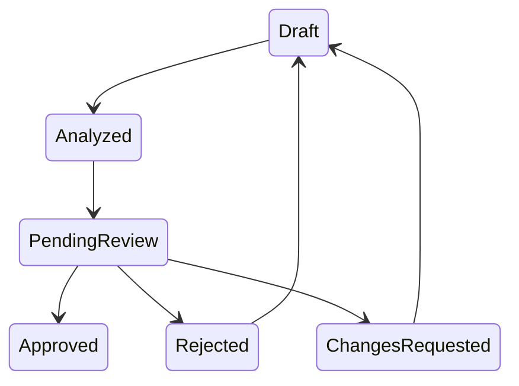

# Workflow
Draft -> (audit) Analyzed -> Pending Review -> Approved | Rejected | Changes Requested. Changes Requested/Rejected -> Draft (Return to Editing).

```mermaid
stateDiagram-v2
Draft --> Analyzed
Analyzed --> PendingReview
PendingReview --> Approved
PendingReview --> Rejected
PendingReview --> ChangesRequested
ChangesRequested --> Draft
Rejected --> Draft
```
